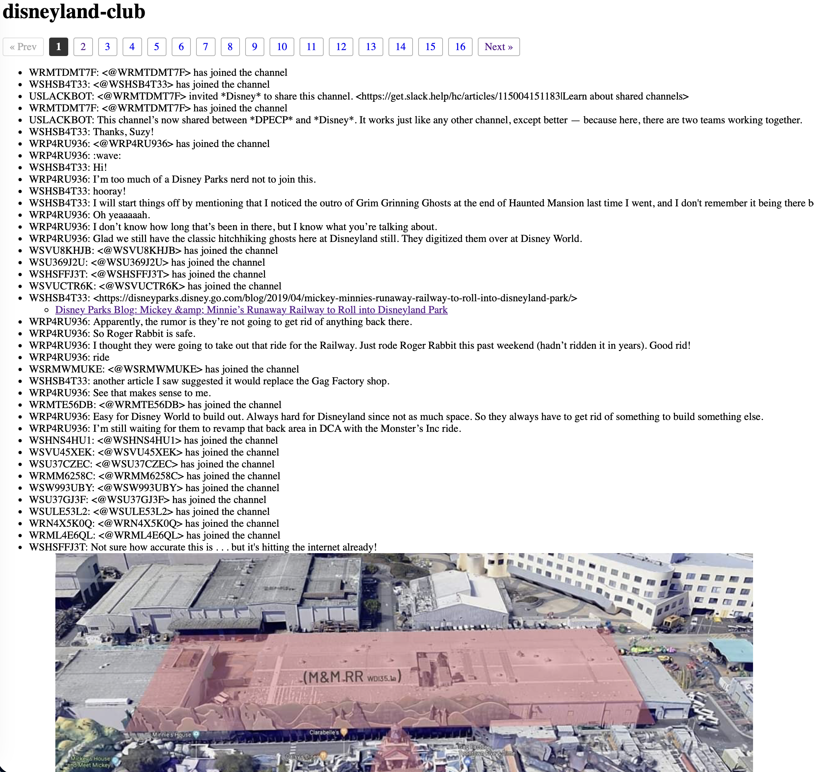
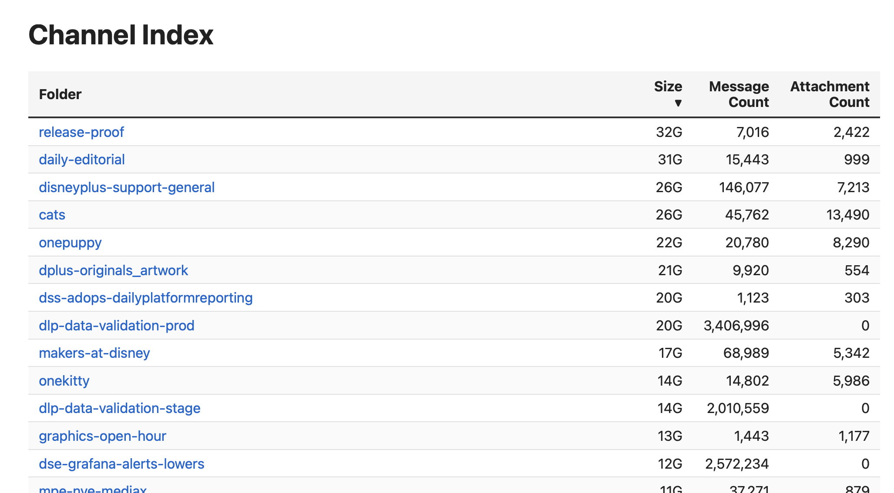

# Scripts For Analyzing DisneyLeaks

## Background

On April 15, 2026, chat logs from nearly 10,000 channels and approximately 2 million 
file attachments, including unreleased projects and images leaked. This is a snapshot 
taken from Disney's internal Slack in May 2024.

In June 2025, Ryan Mitchell Kramer plead guilty to the hack while pretending to be 
part of a fake Russia-based hacktivist group called "NullBulge".

See also: <https://ddosecrets.org/article/disney-internal-slack>

## This Project

This project is a collection of scripts to analyze and process the data dump
and some of the resulting findings. Note that some of the file processing can
take a very log time and a whole lot of disk space. We're dealing with json 
files up to 20GB in size and zip files containing every attachment in a given 
channel. I'm doing this work on a 4GB USB3.2 external drive. You may get faster
speeds in the cloud, depending on what instance size you choose.

The project consists of only scripts. In a few places, for editorial purposes,
I've included summaries or small snapshots of cherry-picked data, but no 
detailed or personal information. It is up to you to decide if you would like 
to download the archive and perform the same sort of analysis for yourself, 
using these scripts.

## Quick Start

- Download this git project.
- Edit config.py to point to your source and destination folders.
- Run `extract.py` to partition the export files into Slack channel folders.
    - This will create subfolders in your output folder named for each Slack channel.
    - The content of the folder will be `index.json` and the file attachments.
    - It will take a very, very long time. Go make some coffee. In fact, go out 
      and have a nice dinner. Come back in several hours.
    - In the event this script gets interrupted, it saves state as it goes and will
      attempt to resume where it left off.
- Run `htmlgenall.py` to convert each index.json into a paginated list of 
  `index.html` files.
- Run `createindex.py` to create the top-level index. In this case, it is a json
  file written to your output folder.
- Copy `index.html` to your output folder. This has the JavaScript code to read
  and sort the individual Slack channels.
- In the output folder, run `python3 -m http.server 8888` — this is required because the HTML needs to load the JSON and can't do that directly from disk. It needs an actual web server.
- Open your browser to <http://localhost:8888>

## Script: Find Anomalies

Spot-checking some of the json and correspondingly-named zip files, I could intuit
at least of the structure of the data. Each json file seemed to have three top-level
fields: `name`, `messages`, and `channel_id`, corresponding to the name of the
Slack channel, a list of all messages in the channel, and the json+zip base
filename. The zip seems to be all file attachments within that channel.

I wanted to validate that assumption by scanning all json files to, first, ensure
they all had these three fields of the correct type (string, list, string) and to
check that no unexpected fields exist.

Results indicate one channel with the correct structure but no messages and
over a dozen empty files. We'll ignore those.

```
# ./find_anomalies.py
Checking files: 9981/9981 (100.0%) GVBKQM3GA.jsonon
C010RMCG05C.json: top-level key 'messages' must be a list, got null
C8CU58RMG.json: invalid JSON at line 1, column 1: Expecting value
C8D803HHA.json: invalid JSON at line 1, column 1: Expecting value
C8DM9UZUL.json: invalid JSON at line 1, column 1: Expecting value
C8EGX1JCD.json: invalid JSON at line 1, column 1: Expecting value
C8EMPGGTD.json: invalid JSON at line 1, column 1: Expecting value
C8ESA8ZLK.json: invalid JSON at line 1, column 1: Expecting value
C8FQHL6TY.json: invalid JSON at line 1, column 1: Expecting value
C8G906RU0.json: invalid JSON at line 1, column 1: Expecting value
C8GCBGUEB.json: invalid JSON at line 1, column 1: Expecting value
C8GFYUMFW.json: invalid JSON at line 1, column 1: Expecting value
C8GS2QSMR.json: invalid JSON at line 1, column 1: Expecting value
C8HA6PZ38.json: invalid JSON at line 1, column 1: Expecting value
C8J31BPE3.json: invalid JSON at line 1, column 1: Expecting value
C8J3UDTUP.json: invalid JSON at line 1, column 1: Expecting value
C8W1WGS31.json: invalid JSON at line 1, column 1: Expecting value
C8XQS5UEB.json: invalid JSON at line 1, column 1: Expecting value
C8Y4V93DL.json: invalid JSON at line 1, column 1: Expecting value
C8Y7Q5XPS.json: invalid JSON at line 1, column 1: Expecting value
C8ZG56ENA.json: invalid JSON at line 1, column 1: Expecting value
C904D6R9U.json: invalid JSON at line 1, column 1: Expecting value
C915QQ7BJ.json: invalid JSON at line 1, column 1: Expecting value
C91MQHSGK.json: invalid JSON at line 1, column 1: Expecting value
C927LU5SB.json: invalid JSON at line 1, column 1: Expecting value
C92B4AJ6T.json: invalid JSON at line 1, column 1: Expecting value
C92B7M2Q3.json: invalid JSON at line 1, column 1: Expecting value
C92GAHM98.json: invalid JSON at line 1, column 1: Expecting value
C92HQDZT4.json: invalid JSON at line 1, column 1: Expecting value
C93GX2ZHD.json: invalid JSON at line 1, column 1: Expecting value
C944NTVCH.json: invalid JSON at line 1, column 1: Expecting value
```

## Script: Channel Names

A simple shell script to extract channel names without extensive json parsing.
The output is:

- [channel_names.txt](channel_names.txt)
- [channel_names-sorted.txt](channel_names-sorted.txt)

## Script: Sort and Expand Attachments

Next, I wanted to take each json file, having a name like `C15FJTCK0.json`, 
peek at the `name` field (indicating channel name such as `boardgames`), and 
copy it over into a folder named after that channel name. That makes it easier 
to browse the channels by name. The same script also extracts the contents of 
the zip file into the same folder, keeping messages and attachments together.

After expansion, we can run the `du` tool, sorted, to find the most active
channels out of the 9,944 in the archive. (Or if not technically the most 
active, at least the channels with the most content.)

The top channel are:

- 32G : release-proof
- 31G : daily-editorial
- 26G : disneyplus-support-general
- 26G : cats
- 22G : onepuppy
- 21G : dplus-originals_artwork
- 20G : dss-adops-dailyplatformreporting
- 20G : dlp-data-validation-prod
- 17G : makers-at-disney
- 14G : onekitty
- 14G : dlp-data-validation-stage
- 13G : graphics-open-hour
- 12G : dse-grafana-alerts-lowers
- 11G : mpe-nve-mediax
- 11G : dlp-e2e-nrt-app
- 11G : bunsen-and-beakers-lab
- 10G : internal-discussion_analytics
- 10G : celebratingdisney
- 9.3G : disneycentralwahexperience
- 9.2G : dlp_test_rocky
- 9.0G : hey_disney_qa_videos
- 8.6G : dlp_mobile_testing_discussions
- 7.9G : ds-it-support-plus
- 7.6G : report-vod-issues
- 6.7G : dprd-vision-releases
- ...

## Script: Channel HTML Generation

For a specific folder, you can point `htmlgen.py` at it. This will convert the
`index.json` file into a sequence of `index*.html` files (for pagination).

For the entirety of the output, run `htmlgenall.py` to generate HTML indexes
for all of the folders.



## Script: HTML Generation of Index for All Channels

Run the `createindex.py` file to generate a top-level index of all channels.
This is output as a json file with channel name, disk space used, message
count, and attachment count. You'll want to copy the `index.html` file, which
loads this data file and gives you sortable columns.



## Script: File Types

Run `filetypes.py` to generate two files:

- [filetypes.txt](filetypes.txt) : A list of file extensions and counts, sorted by count.
- filetypes-none.txt : A list of all files without extensions.

```
1162086  (no ext)
606852  .png
129426  .jpg
 20497  .txt
 17545  .xlsx
 13401  .pdf
  7980  .mp4
  6400  .docx
  6276  .jpeg
  6215  .mov
  4880  .csv
  4016  .gif
  2400  .zip
  2387  .chls
  1805  .xml
  1706  .mobileprovision
  1500  .heic
  1428  .pptx
  1409  .json
   895  .sql
...
```